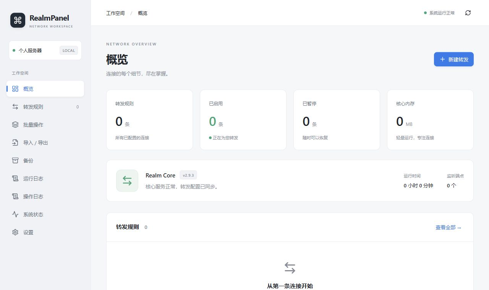

# RealmPanel

基于 **Realm v2.9.3** 的轻量 TCP / UDP 转发管理面板。Web 管理规则，Realm 负责真实转发；无需域名或证书，Docker 部署。

当前为 **0.9.3 验收版本**。设计原文见 [DESIGN.md](DESIGN.md)，真实验收范围见 [ACCEPTANCE.md](ACCEPTANCE.md)。未完成全矩阵验收前不会标记为 1.0.0。



## 功能

- 随机端口、管理路径、管理员账号及高强度密码；支持安装时自定义。
- TCP / UDP / TCP+UDP，IPv4 / IPv6 / 域名目标，规则启停、编辑、复制、分组及批量操作。
- Through（出口源 IP）、Interface（出口网卡）、TCP / UDP 超时和 TCP Keepalive。
- 每次修改先加密备份，再生成配置、重启 Realm、核对 Realm 自身监听；失败整体回滚。
- JSON / CSV 导入预览及冲突处理（跳过、覆盖、寻找新端口），批量文本添加。
- 备份管理、运行日志、操作审计、账号修改、SSH 重置、访问白名单。
- 紧凑的中文表单与表格、响应式移动布局、黑白主题切换；每条规则支持编辑、暂停/恢复、诊断、复制和删除。

## 系统要求

Linux **x86_64 / ARM64**，建议至少 512 MB 内存、3 GB 可用磁盘。安装仅需下载 GitHub Releases 预编译镜像，不需要 VPS 访问 npm/PyPI 或编译代码。

安装器支持 Ubuntu 22.04+、Debian 11+、Rocky Linux / AlmaLinux / RHEL / CentOS Stream 8+、Fedora、Alpine。使用 apt、dnf/yum 或 apk 安装依赖，适配 systemd / OpenRC。不同发行版的实际验证层次详见验收记录；发行版派生环境不冒充官方 Docker 支持。

## 安装

在 root SSH 终端执行一键安装（安装器使用 GitHub Releases 预编译镜像）：

```bash
curl -fsSL https://github.com/xiaofujie369/RealmPanel/releases/latest/download/install.sh | bash
```

全随机无人值守安装：

```bash
curl -fsSL https://github.com/xiaofujie369/RealmPanel/releases/latest/download/install.sh | RMP_PUBLIC_IP=服务器公网IP bash -s -- --yes
```

安装于 `/opt/realm-panel`，登录信息保存在 `/root/realm-panel-install-info.txt`（权限 600）。密码进入数据库前使用 Argon2id 哈希。安装信息文件是按设计要求保存的初始凭据，请妥善保管；后续修改密码不会更新该旧文件。

安装会先确保至少约 1 GB Swap；已有足够 Swap 时保留原配置，否则建立 `/var/lib/realm-panel/swapfile` 并写入开机配置。Swap 是磁盘交换空间，不是物理内存，也不是 Cloudflare WARP。禁止 Swap 的 OpenVZ/LXC 环境会明确报错，可在确认内存足够后显式设置 `RMP_SKIP_SWAP=1`。Btrfs 需安装 `btrfs-progs`。

安装器自动检查并安装 Docker/Compose，现有 Docker 环境会复用；所有镜像从 GitHub Release 加载，**不在 VPS 上执行 docker build、npm 或 pip**。下载包含 SHA256 校验和重试。Alpine 极简镜像若没有 bash/curl，先执行 `apk add bash curl`。

固定版本安装：

```bash
curl -fsSL https://github.com/xiaofujie369/RealmPanel/releases/latest/download/install.sh | RMP_VERSION=0.9.3 bash -s -- --yes
```

重复运行安装器不会重置已有数据；已安装环境使用 `rmpctl update`。

## 日常使用

1. 打开安装器显示的完整管理地址，输入管理员账号密码。
2. 在「转发规则」创建规则，设置监听和目标地址、端口及协议。
3. 保存后自动应用；不需要重新执行 Compose 或编辑 TOML。
4. 从「导入 / 导出」下载配置，上传到其他服务器后先预览再确认应用。

新规则默认 TCP+UDP。空规则时 Supervisor 正常待机，不运行空配置下会自行退出的 Realm 进程。「即时应用」采用安全重启，会断开当前 Realm 连接。

## CLI

```bash
rmpctl status
rmpctl start
rmpctl stop
rmpctl restart
rmpctl logs
rmpctl info
rmpctl reset-password
rmpctl reset-path
rmpctl backup
rmpctl restore-full --file 备份UUID
rmpctl update
rmpctl update 0.9.3
rmpctl uninstall
```

`info` 不显示密码。`reset-path` 同时清空白名单并退出全部会话，便于误锁时恢复访问。Web 备份恢复只恢复规则、分组和网络参数，保留当前登录与管理地址；SSH `restore-full` 还原备份中的账号与 Web 设置。

更新先下载预编译镜像，再保存完整安装目录和数据、保留旧镜像；迁移或健康检查失败会恢复旧代码、数据和镜像。升级备份保留在 `/opt/realm-panel-update.*`，包含秘密数据，仅由 root 访问。默认更新源为本仓库最新 GitHub Release。

卸载会提供「保留数据」「完全删除」「取消」三个选项。仅操作 `/opt/realm-panel` 和 `/usr/local/bin/rmpctl`，不会卸载系统 Docker、Swap 或其他业务容器。

## JSON 格式

扩展名 `.rmp.json`，不导出账号、哈希、Session、管理路径或秘密信息：

```json
{
  "format": "realm-panel",
  "schema_version": 1,
  "realm_version": "2.9.3",
  "settings": {"tcp_timeout": 5, "udp_timeout": 30, "tcp_keepalive": 15},
  "groups": [{"name": "美国"}],
  "rules": [{
    "name": "美国01", "group": "美国", "enabled": true,
    "listen_host": "0.0.0.0", "listen_port": 2088,
    "remote_host": "example.com", "remote_port": 443,
    "protocol": "tcp_udp", "through": "", "interface": "",
    "tcp_timeout": null, "udp_timeout": null, "tcp_keepalive": null,
    "remark": "美国落地"
  }]
}
```

高级参数为 `null` 时使用全局默认值。JSON 导入同时应用其全局网络参数。不同监听地址在通配地址覆盖时也被识别为冲突；默认不允许同端口重复，即使协议不同。

## CSV 与批量文本

CSV 为 UTF-8 BOM，包含完整规则参数，支持中文、逗号和换行：

```csv
name,group,enabled,listen_host,listen_port,remote_host,remote_port,protocol,through,interface,tcp_timeout,udp_timeout,tcp_keepalive,remark
美国01,美国,true,0.0.0.0,2088,example.com,443,tcp_udp,,,,,,美国落地
```

以公式字符开头的名称、分组及备注会增加前导单引号，防止电子表格公式注入；重新导入时自动还原。CSV 不改变全局网络设置，空高级参数采用全局值。

批量文本：

```text
2088|example.com|443|tcp_udp|美国01
2089|1.1.1.1|443|tcp|备用线路
```

最大单次导入 2 MB / 2000 条规则。预览 15 分钟有效，绑定当前会话和配置版本；预览后配置变化必须重新解析。存在无效条目时禁止整个导入。多个操作不会并发改写 Realm。

## 数据及备份

```text
/opt/realm-panel/
├── backend/ frontend/ docker/ scripts/ tests/
├── docker-compose.yml
├── vendor/realm
└── data/
    ├── database/realm-panel.db
    ├── realm/active.json
    ├── run/supervisor.sock
    ├── backups/*.rmpbak
    ├── logs/
    └── secrets/backup.key
```

**请不要直接编辑 RealmPanel 生成的 Realm 配置文件。请通过 Web 后台修改规则。** 数据库是唯一事实来源，启动和下次应用时会重建配置。

Realm 官方支持 JSON 和 TOML；本实现使用等价 JSON，以标准 JSON 编码避免字符串转义错误。字段按官方 v2.9.3 的 `src/conf/net.rs` 与 `src/conf/endpoint.rs` 校对。

`.rmpbak` 是 Fernet 认证加密的逻辑数据库快照（账号、Web 设置、分组、规则），密钥保存在 `data/secrets/backup.key`。下载备份时不会下载密钥，异地恢复前需单独安全保管密钥；密钥遗失则无法解密备份。备份不迁移登录会话。自动保留最近 30 份，可设为 10/20/30/50/100。

运行日志由 Docker 轮转（每容器 3 × 5 MB），Web 显示 Supervisor 最近 1000 行。审计日志在 SQLite 中保留最近 10000 条。系统状态每 10 秒检查，界面概览每 15 秒刷新；运行日志自动刷新默认关闭。

## 安全与架构

- 两容器均为 host 网络，添加端口无需修改 Compose。
- Web 没有 Docker Socket；Supervisor 只接受固定的状态、日志和重启操作。
- 根文件系统只读、移除 Linux capabilities、禁止提升权限。核心仅保留绑定低端口权限。
- 所有 API 都位于随机管理路径下，未知路径统一 404，无公开 OpenAPI / Swagger。
- Session 12 小时，HttpOnly + SameSite=Strict；HTTP 不强制 Secure，直接 HTTPS 请求时自动 Secure。
- 修改操作验证 CSRF Token、同源请求标记和 Origin。五次失败锁定来源 IP 15 分钟。
- 账号密码修改后撤销全部 Session。默认不信任代理转发头，IP 白名单按真实直连地址计算。
- HTTP 不加密传输；需要加密管理链路时可通过 SSH 隧道访问。随机路径不是加密措施。
- 仅一个管理账号，单 Uvicorn worker。不要擅自增加多 worker，否则进程内应用锁不能保证一致性。

## 开发与测试

```bash
python -m pip install -r backend/requirements.txt
python -m pytest tests/test_backend.py -q
cd frontend && npm ci && npm run build
```

`tests/live_acceptance.py` 在全新空规则安装上执行真实 TCP/UDP 与 API 验收，会创建并清理测试规则。不要对有业务规则的面板运行该脚本。完整 Linux Docker 构建和安装以验收记录为准。

开发环境手动构建（不用于低配 VPS 安装）：

```bash
python3 scripts/download-realm.py
docker compose -f docker-compose.yml -f docker-compose.build.yml build
```

GitHub Actions 会执行后端测试、TypeScript 检查、前端构建、npm 审计、多个发行版的安装工具检查，并在 amd64 / arm64 两种原生 runner 上构建镜像、执行真实 TCP/UDP 验收。推送与 VERSION 一致的 `v*` 标签后，流水线创建包含两个架构镜像、源码、安装器及 SHA256SUMS 的 Release。只有全部构建和实测成功后才公开 Release。

## FAQ

**访问根路径返回 404？** 必须使用安装器显示的完整随机路径，包含末尾 `/`。

**忘记地址或密码？** 使用 `rmpctl info` 或 `rmpctl reset-password`。白名单误锁用 `rmpctl reset-path`。

**端口已占用？** 使用其他未占用端口。应用后由 Supervisor 检查 Realm 自己实际持有的 TCP/UDP socket，不能只靠其他进程正在监听来冒充成功。

**UDP 测试成功是否证明远端可用？** 发送完成不能证明远端应用正确响应。真实 UDP 转发验收使用回显服务验证请求及返回数据。

**如何切换黑白主题？** 点击顶栏的太阳/月亮按钮，或在「设置 → 外观」选择亮色、暗色、跟随系统。偏好保存在当前浏览器。

**为什么界面显示 0.9.3？** 双 VPS、Excel 手工往返及完整虚拟机操作系统矩阵仍需要对应环境。未经执行的项目不会写成通过。

## 许可

RealmPanel 使用 MIT License。Realm 为独立上游项目，其二进制与许可遵循 [zhboner/realm](https://github.com/zhboner/realm/tree/v2.9.3)。
